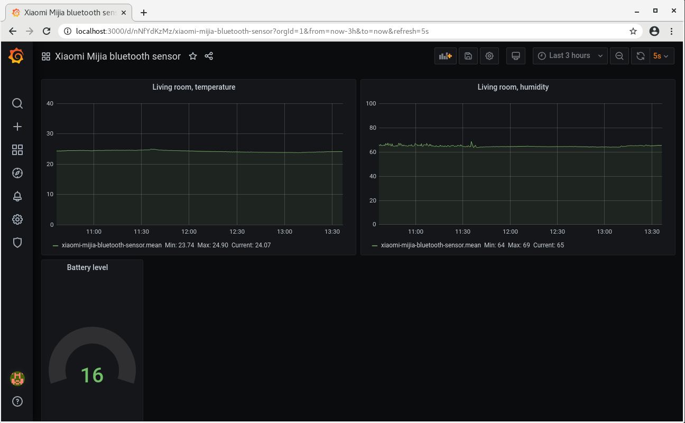

= Xiaomi Mijia bluetooth temperature/humidity sensor

This is an application for collecting sensor measurements from Xiaomi Mijia bluetooth temperature/humidity sensor.
It's based on reading output of `hcidump` tool and passive scanning of BLE devices with `hcitool` tool.
The description of a protocol used by the sensor is described at the following link:
https://github.com/mspider65/Xiaomi-Mijia-Bluetooth-Temperature-and-Humidity-Sensor/blob/master/SensorProtocol.html

== Dependencies

- openjdk-11-jdk
- bluez
- bluez-hcidump

== Build

```
./gradlew clean build
```

== Usage

. Start scanning for BLE devices in passive mode
+
```bash
hciconfig hci0 up
hcitool lescan --passive --duplicates
```
+
[TIP]
--
The `hcitool lescan` command may fail with various errors, for example:
`Set scan parameters failed: Input/output error`

You may try to fix it with `hciconfig hci0 reset` or `rfkill unblock bluetooth`.
--

. Start the collector specifying MAC address(es) of sensors to monitor
+
```bash
hcidump -R | ./xiaomi-mijia-bluetooth-sensor 582D3430247C 362D34303089 ...
```
The following is example output:
+
```bash
{"time":"2020-05-21T06:51:24.450Z","humidity":34.3,"temperature":22.1,"mac":"582D3430247C"}
{"time":"2020-05-21T06:51:26.447Z","temperature":22.1,"mac":"582D3430247C"}
{"time":"2020-05-21T06:51:28.454Z","humidity":34.2,"temperature":22.1,"mac":"582D3430247C"}
{"time":"2020-05-21T06:51:34.465Z","humidity":34.1,"temperature":22.0,"mac":"582D3430247C"}
{"time":"2020-05-21T06:51:36.465Z","humidity":34.0,"mac":"582D3430247C"}
{"time":"2020-05-21T06:51:38.467Z","batteryLevel":31.0,"mac":"582D3430247C"}
{"time":"2020-05-21T06:51:40.475Z","humidity":34.2,"temperature":22.0,"mac":"582D3430247C"}
{"time":"2020-05-21T06:51:42.483Z","humidity":34.1,"temperature":22.0,"mac":"582D3430247C"}
{"time":"2020-05-21T06:51:44.481Z","humidity":34.1,"temperature":22.1,"mac":"582D3430247C"}
```

== Sensor data visualisation with Grafana

. Start collecting data from a sensor dumping measurements into file
+
```
hcidump -R | ./xiaomi-mijia-bluetooth-sensor 582D3430247C 362D34303089 ... | tee -a /tmp/metrics.json
```

. Start several docker containers with docker-compose that will run instances of: Telegraf, InfluxDB and Grafana.
+
```bash
SENSOR_METRICS_FILE_PATH=/tmp/metrics.json docker-compose up
```
NOTE: `SENSOR_METRICS_FILE_PATH` should point to the file where metrics from the application are dumped.
This is the file which will be tailed by Telegrag.

. In Grafana, add a datasource of type InfluxDB pointing to database created by telegraf

. Import the dashboard: grafana-dashbpard.json or just use `Explore` to monitor temperature measurements:
+
```
Data Source: InfluxDB
From: defaul xiaomi-mijia-bluetooth-sensor
Select: field(temperature) mean()
Group By: time($_interval) fill(null)
Format as: Time series.
```

. Leave things working for several hours

. After several hours you should observe graph(s) full of data
+


== Misc. references

- https://manned.org/hcidump/bdb92bdc
- https://gitlab.com/jtaimisto/bluewalker
- https://github.com/sidddy/flora/issues/8
